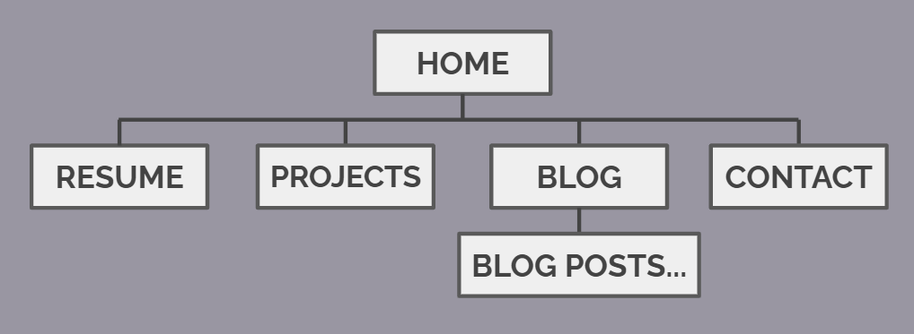
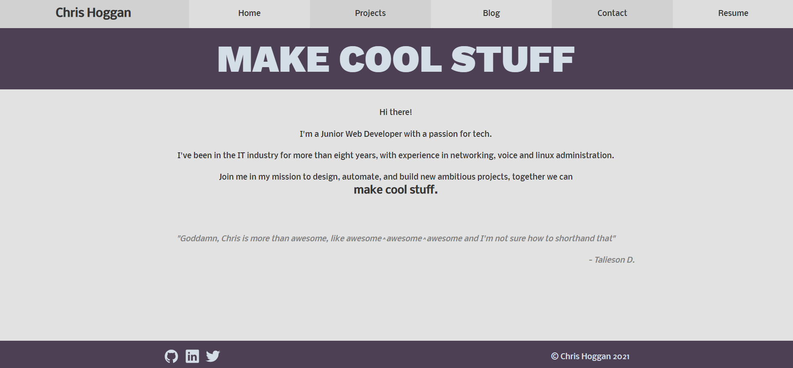
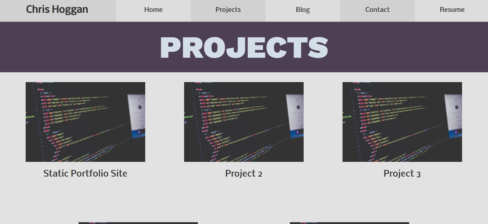
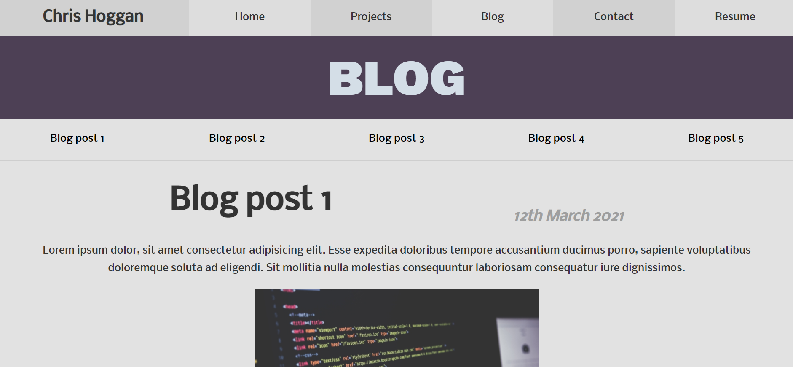
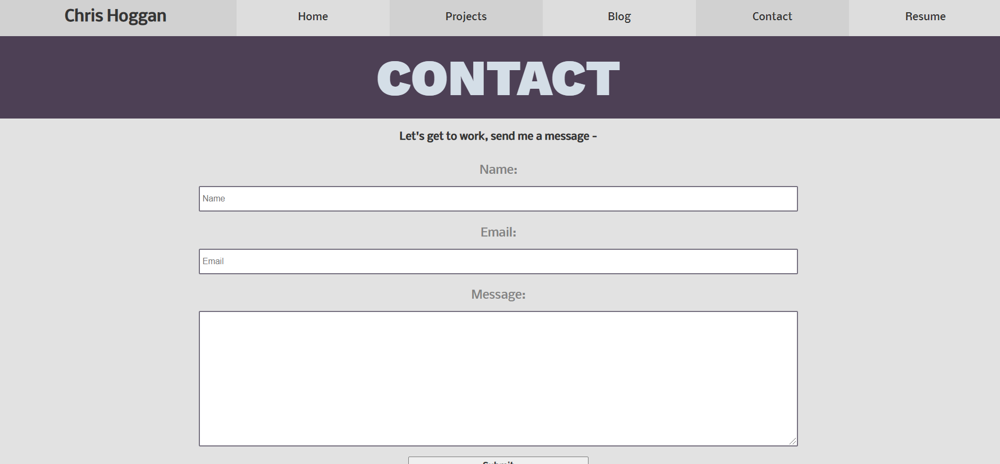
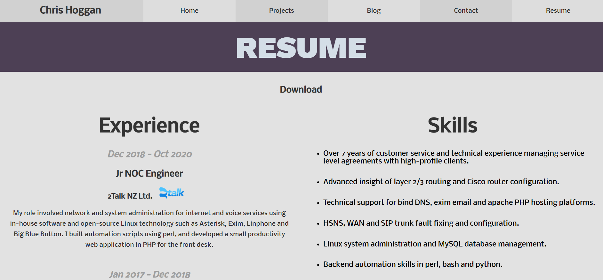

# T1A2 - Portfolio Website

[chrishoggan.com](http://chrishoggan.com)

## Purpose

This website functions as a resume and advertisement for my services as a web developer. The design strives to be clean, professional and attention-hooking in order to attract employers and clients.

## Features

The site structure features 5 pages to direct the audience to view my work and contact me directly:

- The Home page contains a hero/call to action banner at the top of the page to hook attention, along with a short blurb.

- The Projects page contains a link to all my various projects for employers to view.

- The Blog page contains sequential articles I've written on various topics (currently placeholders until I write some content)

- The Contact page contains a form for clients and employers to send me a message and get in touch.

- The Resume page features a styled version of my resume, along with a link to download the plain PDF version.

All pages contain a Nav bar with links to each page that is collapsible on Mobile. They also contain a footer at the end of each page with links to my GitHub and LinkedIn profiles.

## Site Map

Each site is linked to each other, Blog posts are linked seperately on the Blog page.

## Screenshots

### Home

### Projects

### Blog

### Contact

### Resume

## Target Audience

Target Audience is prospective clients and employers.

Site will be completely responsive to mobile, tablet and desktop audience. Accessibility will be a high priority as well to include audiences with disabilities.

## Tech stack

Site will be build statically by hand with basic HTML, CSS and Javascript on no framework. I will likely update this with a framework in future to be able to easily update my site.

Site will be deployed on Netlify.

